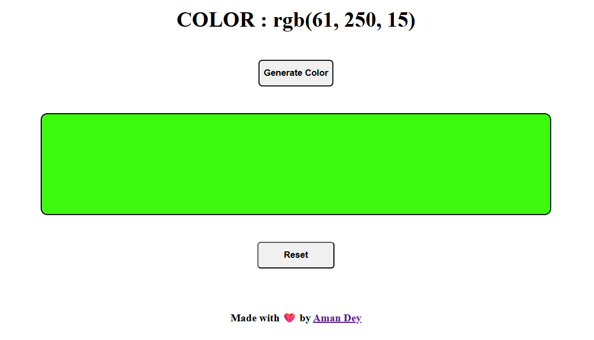

# 🎨 Random Color Generator

A simple and fun web application that generates a random RGB color at the click of a button. Instantly see the generated color and its RGB values displayed visually in a colorful box!

---

## 🌐 Live Website

👉 **Visit Here:** [RandRGB](https://4m4nd3y.github.io/randrgb/)

---

## 🚀 Features

-   🎲 **Random RGB Color Generation**  
    Click the **Generate Color** button to get a new random background color.

-   📋 **Live RGB Value Display**  
    Instantly shows the generated color code in RGB format.

-   🔄 **Reset Functionality**  
    Revert the color back to the default with a single click, without the need for refreshing the page.

-   💻 **Clean UI**  
    Minimalistic design for a smooth user experience.

---

## 🛠️ Tech Stack

-   **HTML5** – Structure
-   **CSS3** – Styling
-   **JavaScript** – Logic and interactivity

---

## 📸 Screenshot



---

## 🔧 How to Use

1. Clone the repository:

    ```bash
    git clone https://github.com/4M4ND3Y/randrgb.git
    ```

2. Navigate into the project folder:

    ```bash
    cd randrgb
    ```

3. Open `index.html` in your browser:

    ```bash
    start index.html
    ```

4. Click **"Generate Color"** to see the magic!

---

## 📁 Folder Structure

```
random-color-generator/
├── index.html
├── style.css
├── app.js
└── README.md
```

---

## ✅ Deployment

The website is hosted via **GitHub Pages**.

To view it live:  
➡️ [RandRGB](https://4m4nd3y.github.io/randrgb/)

---

## 🧠 Inspiration

Built as a fun mini-project to explore DOM manipulation and working with RGB color values dynamically using JavaScript.

---

## 🙋‍♂️ Author

Made with ❤️ by **Aman Dey**

---

## 📃 License

This project is open-source and available under the [MIT License](LICENSE).

---

## 🙌 Contributions

Feel free to fork this repository and contribute with new features, animations, or color formats (like HEX or HSL)!

---
